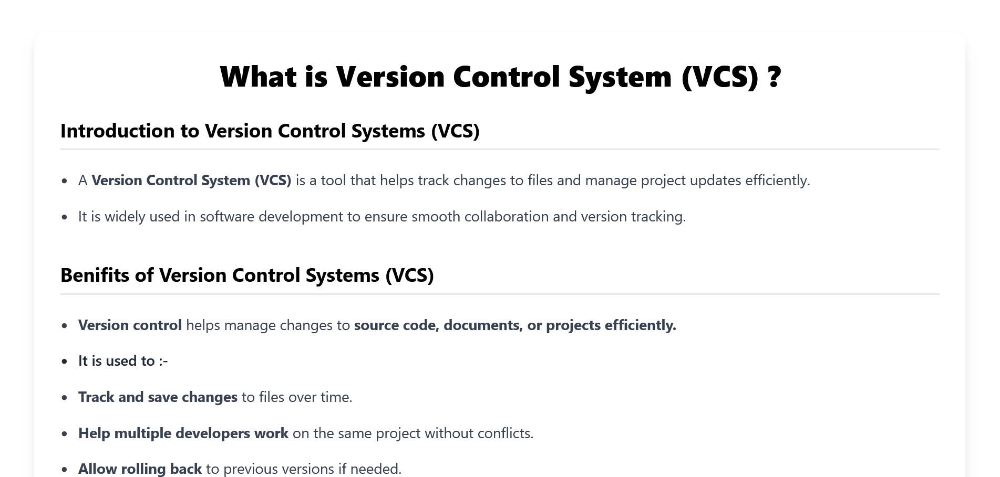

# Git & GitHub Tutorial Notes

A complete beginner-friendly Git and GitHub tutorial created using HTML and Tailwind CSS.

## 📚 Topics Covered

### Git Basics

* Git Introduction
* Git Configuration
* Create Repository (`git init`)
* Check Repository Status (`git status`)
* Add Files (`git add`)
* Commit Changes (`git commit`)
* View Commit History (`git log`)
* View Differences (`git diff`)

### GitHub Basics

* Setting up GitHub
* Create GitHub Repository
* Connect Remote Repository (`git remote`)
* Push Code (`git push`)
* Clone Repository (`git clone`)
* Fetch Changes (`git fetch`)
* Pull Changes (`git pull`)

### Branching in Git

* Working with Branches (`git branch`)
* Switching Branches (`git checkout`)
* Switching Branches (`git switch`)
* Merge Branches (`git merge`)

---

## 🚀 Technologies Used

* HTML5
* Tailwind CSS
* Git
* GitHub

---

## 📂 Project Structure

```bash
git-notes/
│
├── assets/
├── index.html
└── README.md
```

---

## 💻 How to Run the Project

1. Clone the repository

```bash
git clone https://github.com/VikasP-SW/git-notes.git
```

2. Open the project folder

```bash
cd git-notes
```

3. Open `index.html` in your browser

---

## 🔗 GitHub Repository

Repository Link:
https://github.com/VikasP-SW/git-notes

---

## 👨‍💻 Author

Vikas Pawar

* GitHub: https://github.com/VikasP-SW
* LinkedIn: https://www.linkedin.com/in/vikaspawar-dev

---

## ⭐ Features

* Beginner-friendly notes
* Clean UI with Tailwind CSS
* Git command explanations
* Real command screenshots
* Easy to understand examples

---

## 📌 Future Improvements

* Add dark mode
* Add search functionality
* Add responsive sidebar navigation
* Convert into full documentation website

---
## 📸 Project Screenshot


